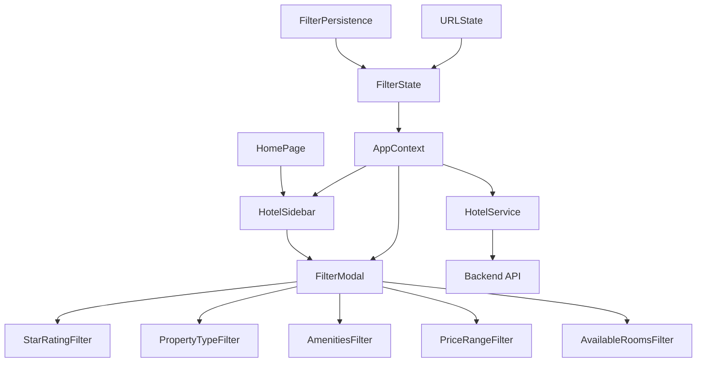
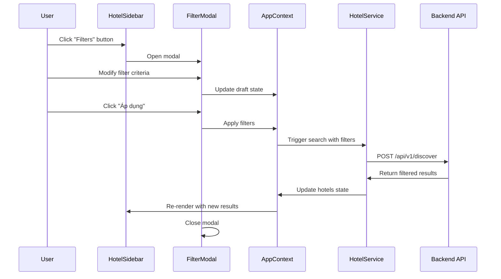

# Hotel Filter System Design Document

## Overview

Hotel Filter System là một hệ thống lọc tìm kiếm khách sạn tích hợp vào React application hiện tại. Hệ thống cung cấp giao diện modal trực quan cho phép người dùng thiết lập các tiêu chí lọc như xếp hạng sao, loại hình lưu trú, tiện nghi, khoảng giá và tình trạng phòng trống. 

Thiết kế dựa trên UI mockup đã cung cấp với modal layout hiện đại, các control tương tác trực quan và tích hợp mượt mà với backend API thông qua Hotel Service. Hệ thống sử dụng React Context để quản lý state và đảm bảo đồng bộ hóa giữa các component.

### Key Features
- Modal interface với 6 loại filter chính
- Real-time state management qua AppContext  
- Backend integration với debounced API calls
- Responsive design với smooth animations
- Filter persistence và URL state synchronization
- Performance optimization với caching và memoization

## Architecture

### Component Architecture



### Data Flow Architecture



### State Management Architecture

Hệ thống sử dụng centralized state management pattern với React Context:

- **AppContext**: Central state store chứa filter state, hotels data, loading states
- **Local Component State**: Draft state trong FilterModal để preview changes
- **Persistence Layer**: localStorage và URL parameters để maintain state
- **Cache Layer**: Memoized results để optimize performance

## Components and Interfaces

### FilterModal Component

**Props Interface:**
```typescript
interface FilterModalProps {
  isOpen: boolean;
  filters: FilterState;
  onClose: () => void;
  onApply: (filters: FilterState) => void;
}
```

**Internal State:**
```typescript
interface FilterModalState {
  draft: FilterState;
  isApplying: boolean;
}
```

**Key Methods:**
- `handleStarRatingChange(rating: number | null)`
- `handlePropertyTypeToggle(type: string)`
- `handleAmenityToggle(amenity: string)`
- `handlePricePresetSelect(preset: PricePreset)`
- `handleAvailableOnlyToggle(enabled: boolean)`
- `handleApply()` - Apply filters và close modal
- `handleCancel()` - Discard changes và close modal

### Filter Sub-Components

#### StarRatingFilter
- Renders 5 buttons (1-5 stars)
- Single selection với toggle off capability
- Visual feedback với primary color cho selected state

#### PropertyTypeFilter  
- Grid layout 3x2 cho 7 property types
- Multiple selection với checkbox interface
- Checkmark icon cho selected items

#### AmenitiesFilter
- Horizontal scrollable row của circular icons
- Multiple selection với visual active state
- Icon + label layout từ AMENITY_META

#### PriceRangeFilter
- 5 preset buttons cho common price ranges
- Single selection với visual active state
- Display current range ở header

#### AvailableRoomsFilter
- Toggle switch component
- Calendar icon với descriptive text
- Boolean state management

### HotelSidebar Integration

**Enhanced Props:**
```typescript
interface HotelSidebarProps {
  onFilterOpen: () => void;
}
```

**Filter Button:**
- Positioned trong header section
- Icon + "Filters" text
- Badge indicator khi có active filters
- Opens FilterModal on click

### AppContext Extensions

**Filter State Structure:**
```typescript
interface FilterState {
  starRating: number | null;
  types: string[];
  amenities: string[];
  priceMin: number | null;
  priceMax: number | null;
  availableOnly: boolean;
}

interface AppContextValue {
  // Existing properties...
  filters: FilterState;
  setFilters: (filters: FilterState) => void;
  updateFilter: (key: keyof FilterState, value: any) => void;
  clearFilters: () => void;
  hasActiveFilters: boolean;
}
```

## Data Models

### FilterState Model
```typescript
interface FilterState {
  starRating: number | null;        // 1-5 hoặc null
  types: string[];                  // Array of PROPERTY_TYPES
  amenities: string[];              // Array of AMENITY_META keys
  priceMin: number | null;          // VND amount
  priceMax: number | null;          // VND amount  
  availableOnly: boolean;           // Room availability filter
}
```

### PricePreset Model
```typescript
interface PricePreset {
  label: string;                    // Display text
  min: number | null;               // Minimum price in VND
  max: number | null;               // Maximum price in VND
}

const PRICE_PRESETS: PricePreset[] = [
  { label: "Dưới 1tr", min: null, max: 1000000 },
  { label: "1-3tr", min: 1000000, max: 3000000 },
  { label: "3-5tr", min: 3000000, max: 5000000 },
  { label: "5-10tr", min: 5000000, max: 10000000 },
  { label: "Trên 10tr", min: 10000000, max: null }
];
```

### SearchParameters Model
```typescript
interface SearchParameters {
  language: string;
  address: string;
  check_in: string;                 // ISO date string
  check_out: string;                // ISO date string
  min_price: number;
  max_price: number;
  radius: number;
  children: number[];               // Ages array
  adults: number;
  personality: string;
  // Filter-specific parameters
  star_rating?: number;
  property_types?: string[];
  amenities?: string[];
  available_only?: boolean;
}
```

### HotelResult Model (Extended)
```typescript
interface HotelResult {
  id: string;
  name: string;
  type: string;                     // Maps to PROPERTY_TYPES
  starRating: number;
  rating: number;
  reviewCount: number;
  pricePerNight: number;
  currency: string;
  address: string;
  lat: number;
  lng: number;
  amenities: string[];              // Array of AMENITY_META keys
  images: string[];
  badge?: string;
  latestReview?: {
    author: string;
    text: string;
  };
  nearbyLandmarks?: Array<{
    name: string;
    distance: string;
  }>;
  // Filter-relevant fields
  availableRooms?: number;
  isAvailable?: boolean;
}
```

## Error Handling

### Filter Validation
- **Invalid Price Range**: Ensure min <= max, handle null values
- **Empty Filter Results**: Show "No stays found" message với suggestions
- **API Timeout**: Fallback to cached results hoặc show retry option
- **Network Errors**: Graceful degradation với offline indicators

### Error Recovery Strategies
- **Filter Reset**: Provide clear filters option khi no results
- **Suggestion System**: Recommend relaxing filters khi too restrictive  
- **Fallback Data**: Use cached/mock data khi API unavailable
- **Progressive Enhancement**: Core functionality works without advanced filters

### Error UI Components
```typescript
interface ErrorState {
  type: 'validation' | 'network' | 'timeout' | 'no-results';
  message: string;
  suggestions?: string[];
  retryAction?: () => void;
}
```

## Testing Strategy

### Unit Testing Approach
- **Component Testing**: Test individual filter components với React Testing Library
- **State Management Testing**: Test AppContext filter state updates
- **Utility Function Testing**: Test filter transformation và validation logic
- **API Integration Testing**: Mock HotelService calls với various filter combinations

### Integration Testing Approach  
- **Filter Flow Testing**: End-to-end filter application workflow
- **State Persistence Testing**: localStorage và URL state synchronization
- **Performance Testing**: Debouncing, caching, và re-render optimization
- **Cross-browser Testing**: Ensure consistent behavior across browsers

### Test Coverage Requirements
- **Component Tests**: 90%+ coverage cho filter components
- **State Tests**: 100% coverage cho filter state management
- **Integration Tests**: Cover all major user workflows
- **Performance Tests**: Measure và validate optimization metrics

### Testing Tools và Frameworks
- **Jest**: Unit testing framework
- **React Testing Library**: Component testing utilities
- **MSW (Mock Service Worker)**: API mocking cho integration tests
- **Cypress**: End-to-end testing cho complete workflows

## Correctness Properties

*A property is a characteristic or behavior that should hold true across all valid executions of a system-essentially, a formal statement about what the system should do. Properties serve as the bridge between human-readable specifications and machine-verifiable correctness guarantees.*

After analyzing the acceptance criteria, several properties emerge that should hold universally across different inputs and states. These properties focus on the core filter logic, state management, and data transformation behaviors that vary meaningfully with different inputs.

### Property 1: Filter Selection Consistency

*For any* filter type (star rating, property type, amenity), the selection state should be consistently reflected in both the UI visual state and the underlying filter state.

**Validates: Requirements 2.2, 2.3, 2.4, 3.2, 3.4, 4.2, 4.5**

### Property 2: Multi-Selection Independence  

*For any* combination of property types or amenities, selecting or deselecting one item should not affect the selection state of other items in the same category.

**Validates: Requirements 3.3, 4.3**

### Property 3: Price Preset Mapping Accuracy

*For any* price preset selection, the resulting min_price and max_price values should exactly match the preset definition, and the display should accurately reflect the selected range.

**Validates: Requirements 5.2, 5.3, 5.4, 5.5**

### Property 4: Filter State Synchronization

*For any* filter modification in the FilterModal, the changes should be accurately reflected in the AppContext state, and vice versa for any programmatic state updates.

**Validates: Requirements 7.2, 7.4**

### Property 5: API Parameter Transformation

*For any* valid filter state, the transformation to API search parameters should include all relevant non-null/non-empty filter values and produce a valid request payload.

**Validates: Requirements 8.1, 8.2, 8.3**

### Property 6: Filter Result Processing

*For any* valid API response containing hotel data, the normalization and filtering logic should correctly process the data and update the hotels state in AppContext.

**Validates: Requirements 8.4, 9.2**

### Property 7: State Persistence Consistency

*For any* filter state change, the persistence mechanism should correctly save the state to localStorage and URL parameters, and restoration should recreate the exact same filter state.

**Validates: Requirements 11.1, 11.2, 11.3, 11.4**

### Property 8: Performance Optimization Effectiveness

*For any* sequence of rapid filter changes, the debouncing mechanism should ensure that only the final state triggers an API call, and identical filter states should reuse cached results.

**Validates: Requirements 12.1, 12.2, 12.3**

### Property 9: Responsive Layout Adaptation

*For any* viewport size within the supported range, the FilterModal should maintain usability and visual hierarchy without content overflow or interaction issues.

**Validates: Requirements 1.5**

### Property 10: Available Rooms Filter Logic

*For any* hotel dataset and date range, when availableOnly is true, the filtered results should contain only hotels with available rooms for the specified dates.

**Validates: Requirements 6.4**