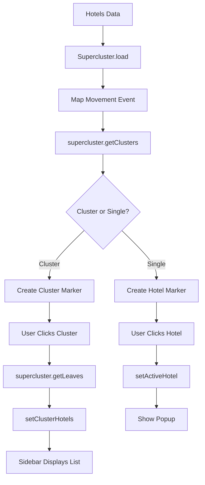

# Design Document: Supercluster Custom Markers

## Overview

This design document specifies the technical implementation for refactoring the VietMapPanel clustering system from GeoJSON-based circle layers to custom React markers using the supercluster library. The refactoring enables richer visual experiences by displaying hotel thumbnail images in cluster markers and provides better cluster exploration through sidebar integration.

### Current State

The VietMapPanel currently uses MapLibre's native GeoJSON clustering:
- Hotels are added as a GeoJSON source with `cluster: true`
- Clusters are rendered as circle layers with numeric badges
- Cluster expansion is handled via `getClusterExpansionZoom()`
- Individual hotel markers are custom div-based markers

### Target State

The refactored implementation will:
- Use supercluster library for cluster calculation
- Render all markers (clusters and hotels) as custom div elements
- Display hotel thumbnail images in cluster markers
- Show "+N" badges for additional hotels in clusters
- Enable cluster exploration through sidebar integration
- Maintain all existing map features (radius circle, user location, controls)

### Key Benefits

1. **Visual Richness**: Hotel thumbnails in cluster markers provide immediate visual context
2. **Better UX**: Clicking clusters shows all hotels in sidebar for easy exploration
3. **Flexibility**: Custom markers allow for complex styling and interactions
4. **Performance**: Supercluster is optimized for fast clustering with large datasets
5. **Maintainability**: Centralized cluster logic in React component lifecycle

## Architecture

### Component Structure

```
VietMapPanel (Main Component)
├── Map Initialization (useEffect)
├── Supercluster Instance (useRef)
├── Cluster Markers Management (useRef)
├── Hotel Markers Management (useRef)
├── Cluster Calculation (useEffect on map movement)
├── Marker Rendering (function)
└── Event Handlers (cluster click, marker click)

AppContext (State Management)
├── hotels (existing)
├── activeHotel (existing)
├── clusterHotels (new)
└── setClusterHotels (new)

HotelSidebar (Display Component)
├── Active Hotel Display (existing)
├── Cluster Hotels List (new)
└── Hotel Selection Handler (updated)
```

### Data Flow



### State Management

**AppContext Updates:**
```javascript
{
  // Existing state
  hotels: Array<Hotel>,
  activeHotel: Hotel | null,
  userLoc: { lat: number, lng: number },
  radiusM: number,
  
  // New state
  clusterHotels: Array<Hotel>, // Hotels in selected cluster
  setClusterHotels: (hotels: Array<Hotel>) => void
}
```

## Components and Interfaces

### Supercluster Configuration

```javascript
const superclusterConfig = {
  radius: 50,        // Cluster radius in pixels
  maxZoom: 14,       // Max zoom to cluster points on
  minZoom: 0,        // Min zoom to cluster points on
  minPoints: 2,      // Minimum points to form a cluster
  extent: 512,       // Tile extent (default)
  nodeSize: 64       // Size of KD-tree leaf node (default)
};
```

**Rationale:**
- `radius: 50` matches the current GeoJSON clustering radius
- `maxZoom: 14` prevents clustering at high zoom levels where individual hotels should be visible
- `minPoints: 2` ensures single hotels are not clustered

### Cluster Marker Element Structure

```javascript
// Cluster marker DOM structure
<div class="cluster-marker" style="...">
  
  <div class="cluster-badge">+2</div>
</div>
```

**Styling:**
```css
.cluster-marker {
  width: 60px;
  height: 60px;
  border-radius: 50%;
  border: 3px solid white;
  box-shadow: 0 4px 12px rgba(0,0,0,0.15);
  overflow: hidden;
  cursor: pointer;
  position: relative;
  transition: transform 0.2s ease, filter 0.2s ease;
}

.cluster-marker:hover {
  transform: scale(1.05);
  filter: brightness(1.1);
}

.cluster-badge {
  position: absolute;
  top: -4px;
  right: -4px;
  background: #ff5a3c;
  color: white;
  font-size: 12px;
  font-weight: 700;
  padding: 2px 6px;
  border-radius: 10px;
  border: 2px solid white;
  box-shadow: 0 2px 4px rgba(0,0,0,0.2);
}
```

### Hotel Marker Element (Existing)

The existing `createHotelMarkerElement` function will be reused for single hotel markers:
- 52px diameter when inside search radius
- 42px diameter when outside search radius
- Circular with white border and shadow
- Displays hotel thumbnail image

### Marker Lifecycle Management

```javascript
// Refs for marker management
const clusterMarkersRef = useRef([]); // Array of cluster markers
const hotelMarkersRef = useRef([]);   // Array of hotel markers
const superclusterRef = useRef(null); // Supercluster instance

// Cleanup function
function clearAllMarkers() {
  clusterMarkersRef.current.forEach(marker => marker.remove());
  hotelMarkersRef.current.forEach(marker => marker.remove());
  clusterMarkersRef.current = [];
  hotelMarkersRef.current = [];
}
```

## Data Models

### Supercluster Point Format

```javascript
{
  type: "Feature",
  geometry: {
    type: "Point",
    coordinates: [lng, lat]
  },
  properties: {
    hotel: {
      id: string,
      name: string,
      lat: number,
      lng: number,
      thumbnail: string,
      images: Array<string>,
      pricePerNight: number,
      address: string,
      link: string,
      // ... other hotel properties
    }
  }
}
```

### Cluster Object Format

```javascript
{
  type: "Feature",
  id: number,                    // Cluster ID
  properties: {
    cluster: true,
    cluster_id: number,
    point_count: number,         // Total hotels in cluster
    point_count_abbreviated: string
  },
  geometry: {
    type: "Point",
    coordinates: [lng, lat]
  }
}
```

### Hotel Object Format (Existing)

```javascript
{
  id: string,
  name: string,
  lat: number,
  lng: number,
  thumbnail: string,
  images: Array<string>,
  pricePerNight: number,
  address: string,
  link: string,
  rating: number,
  // ... other properties
}
```

## Error Handling

### Invalid Coordinates

**Problem:** Hotels with null or invalid lat/lng values
**Solution:** Filter hotels before loading into supercluster

```javascript
const validHotels = hotels.filter(hotel => 
  hotel.lat != null && 
  hotel.lng != null &&
  typeof hotel.lat === 'number' &&
  typeof hotel.lng === 'number' &&
  !isNaN(hotel.lat) &&
  !isNaN(hotel.lng)
);
```

### Missing Images

**Problem:** Hotels without thumbnail or images array
**Solution:** Use placeholder image

```javascript
const thumbnailUrl = hotel.thumbnail || 
                     hotel.images?.[0] || 
                     '/placeholder-hotel.jpg';
```

### Empty Clusters

**Problem:** `getLeaves()` returns empty array
**Solution:** Guard clause before opening popup

```javascript
const clusterHotels = supercluster.getLeaves(clusterId, Infinity);
if (clusterHotels.length === 0) {
  console.warn('Empty cluster detected:', clusterId);
  return;
}
```

### Empty Hotels Array

**Problem:** No hotels to cluster
**Solution:** Skip supercluster initialization

```javascript
if (!hotels || hotels.length === 0) {
  clearAllMarkers();
  return;
}
```

### Map Not Ready

**Problem:** Attempting to add markers before map is initialized
**Solution:** Guard clauses checking mapReady state

```javascript
if (!mapReady || !mapObjRef.current || !window.vietmapgl) {
  return;
}
```

### Supercluster Errors

**Problem:** Supercluster operations may throw errors
**Solution:** Try-catch blocks with fallback behavior

```javascript
try {
  const clusters = supercluster.getClusters(bounds, zoom);
  renderMarkers(clusters);
} catch (error) {
  console.error('Supercluster error:', error);
  // Fallback: render all hotels as individual markers
  renderFallbackMarkers(hotels);
}
```

## Testing Strategy

This feature involves UI rendering, DOM manipulation, and map interactions - areas where property-based testing is not appropriate. The testing strategy focuses on unit tests for pure functions and integration tests for user interactions.

### Why Property-Based Testing Is Not Applicable

Property-based testing (PBT) is not suitable for this feature because:

1. **UI Rendering**: Cluster markers are visual DOM elements with styling and layout - PBT cannot verify visual correctness
2. **DOM Manipulation**: Creating, updating, and removing markers involves imperative DOM operations - not pure functions with universal properties
3. **External Dependencies**: Map interactions depend on VietMap GL JS library behavior - not our code's logic
4. **Side Effects**: Marker lifecycle management involves side effects (adding/removing from map) - not testable as pure properties
5. **Visual Validation**: Correct behavior requires visual inspection (marker appearance, animations, hover effects) - not computable properties

Instead, we use:
- **Unit tests** for pure utility functions (coordinate validation, data transformation)
- **Integration tests** for user interactions and component behavior
- **Visual regression tests** for UI appearance (future enhancement)
- **Performance tests** for rendering speed and responsiveness

### Unit Tests

**Coordinate Validation Functions:**
```javascript
describe('validateHotelCoordinates', () => {
  it('should filter out hotels with null coordinates', () => {
    const hotels = [
      { id: '1', lat: 10.7, lng: 106.7 },
      { id: '2', lat: null, lng: 106.7 },
      { id: '3', lat: 10.7, lng: null }
    ];
    const valid = validateHotelCoordinates(hotels);
    expect(valid).toHaveLength(1);
    expect(valid[0].id).toBe('1');
  });

  it('should filter out hotels with NaN coordinates', () => {
    const hotels = [
      { id: '1', lat: 10.7, lng: 106.7 },
      { id: '2', lat: NaN, lng: 106.7 }
    ];
    const valid = validateHotelCoordinates(hotels);
    expect(valid).toHaveLength(1);
  });

  it('should filter out hotels with non-number coordinates', () => {
    const hotels = [
      { id: '1', lat: 10.7, lng: 106.7 },
      { id: '2', lat: '10.7', lng: 106.7 }
    ];
    const valid = validateHotelCoordinates(hotels);
    expect(valid).toHaveLength(1);
  });
});
```

**Data Transformation Functions:**
```javascript
describe('convertHotelsToSuperclusterPoints', () => {
  it('should convert valid hotels to GeoJSON points', () => {
    const hotels = [
      { id: '1', name: 'Hotel A', lat: 10.7, lng: 106.7 }
    ];
    const points = convertHotelsToSuperclusterPoints(hotels);
    expect(points).toHaveLength(1);
    expect(points[0].type).toBe('Feature');
    expect(points[0].geometry.type).toBe('Point');
    expect(points[0].geometry.coordinates).toEqual([106.7, 10.7]);
    expect(points[0].properties.hotel.id).toBe('1');
  });

  it('should handle empty hotel array', () => {
    const points = convertHotelsToSuperclusterPoints([]);
    expect(points).toEqual([]);
  });
});
```

**Thumbnail URL Resolution:**
```javascript
describe('getHotelThumbnailUrl', () => {
  it('should return thumbnail if available', () => {
    const hotel = { thumbnail: 'thumb.jpg', images: ['img1.jpg'] };
    expect(getHotelThumbnailUrl(hotel)).toBe('thumb.jpg');
  });

  it('should return first image if no thumbnail', () => {
    const hotel = { images: ['img1.jpg', 'img2.jpg'] };
    expect(getHotelThumbnailUrl(hotel)).toBe('img1.jpg');
  });

  it('should return placeholder if no images', () => {
    const hotel = {};
    expect(getHotelThumbnailUrl(hotel)).toBe('/placeholder-hotel.jpg');
  });
});
```

**Cluster Badge Text:**
```javascript
describe('getClusterBadgeText', () => {
  it('should return "+N" for N additional hotels', () => {
    expect(getClusterBadgeText(3)).toBe('+2');
    expect(getClusterBadgeText(10)).toBe('+9');
  });

  it('should handle single hotel cluster', () => {
    expect(getClusterBadgeText(1)).toBe('');
  });

  it('should handle large clusters', () => {
    expect(getClusterBadgeText(100)).toBe('+99');
  });
});
```

### Integration Tests

**Supercluster Initialization:**
```javascript
describe('VietMapPanel - Supercluster', () => {
  it('should initialize supercluster with hotel data', () => {
    const { result } = renderHook(() => useVietMapPanel(mockHotels));
    expect(result.current.supercluster).toBeDefined();
    expect(result.current.supercluster.points).toHaveLength(mockHotels.length);
  });

  it('should update supercluster when hotels change', () => {
    const { result, rerender } = renderHook(
      ({ hotels }) => useVietMapPanel(hotels),
      { initialProps: { hotels: mockHotels } }
    );
    const newHotels = [...mockHotels, { id: 'new', lat: 10.8, lng: 106.8 }];
    rerender({ hotels: newHotels });
    expect(result.current.supercluster.points).toHaveLength(newHotels.length);
  });
});
```

**Cluster Marker Rendering:**
```javascript
describe('VietMapPanel - Marker Rendering', () => {
  it('should render cluster markers on map load', async () => {
    render(<VietMapPanel />);
    await waitFor(() => {
      const markers = screen.getAllByTestId('cluster-marker');
      expect(markers.length).toBeGreaterThan(0);
    });
  });

  it('should update markers on map movement', async () => {
    const { container } = render(<VietMapPanel />);
    const map = getMapInstance(container);
    
    act(() => {
      map.setCenter([106.8, 10.8]);
      map.fire('moveend');
    });

    await waitFor(() => {
      const markers = screen.getAllByTestId('cluster-marker');
      expect(markers.length).toBeGreaterThan(0);
    });
  });
});
```

**Cluster Click Interaction:**
```javascript
describe('VietMapPanel - Cluster Interaction', () => {
  it('should open popup and update sidebar on cluster click', async () => {
    const { getByTestId } = render(<App />);
    const clusterMarker = getByTestId('cluster-marker-0');
    
    fireEvent.click(clusterMarker);

    await waitFor(() => {
      expect(getByTestId('hotel-popup')).toBeInTheDocument();
      expect(getByTestId('cluster-hotels-list')).toBeInTheDocument();
    });
  });

  it('should extract correct hotels from cluster', async () => {
    const { getByTestId } = render(<App />);
    const clusterMarker = getByTestId('cluster-marker-0');
    
    fireEvent.click(clusterMarker);

    await waitFor(() => {
      const hotelItems = screen.getAllByTestId('cluster-hotel-item');
      expect(hotelItems.length).toBeGreaterThan(1);
    });
  });
});
```

**Sidebar Integration:**
```javascript
describe('HotelSidebar - Cluster Hotels', () => {
  it('should display cluster hotels list', () => {
    const clusterHotels = [
      { id: '1', name: 'Hotel A' },
      { id: '2', name: 'Hotel B' }
    ];
    render(<HotelSidebar />, {
      wrapper: ({ children }) => (
        <AppProvider value={{ clusterHotels }}>
          {children}
        </AppProvider>
      )
    });

    expect(screen.getByText('Hotel A')).toBeInTheDocument();
    expect(screen.getByText('Hotel B')).toBeInTheDocument();
  });

  it('should update active hotel on cluster hotel click', () => {
    const setActiveHotel = jest.fn();
    const clusterHotels = [
      { id: '1', name: 'Hotel A' },
      { id: '2', name: 'Hotel B' }
    ];
    
    render(<HotelSidebar />, {
      wrapper: ({ children }) => (
        <AppProvider value={{ clusterHotels, setActiveHotel }}>
          {children}
        </AppProvider>
      )
    });

    fireEvent.click(screen.getByText('Hotel B'));
    expect(setActiveHotel).toHaveBeenCalledWith(clusterHotels[1]);
  });
});
```

**Marker Lifecycle:**
```javascript
describe('VietMapPanel - Marker Lifecycle', () => {
  it('should remove old markers before rendering new ones', async () => {
    const { container } = render(<VietMapPanel />);
    const map = getMapInstance(container);
    
    const initialMarkers = getAllMarkers(map);
    const initialCount = initialMarkers.length;

    act(() => {
      map.setZoom(15);
      map.fire('moveend');
    });

    await waitFor(() => {
      const newMarkers = getAllMarkers(map);
      // Old markers should be removed
      initialMarkers.forEach(marker => {
        expect(marker._element.parentNode).toBeNull();
      });
      // New markers should exist
      expect(newMarkers.length).toBeGreaterThan(0);
    });
  });

  it('should clean up markers on unmount', () => {
    const { container, unmount } = render(<VietMapPanel />);
    const map = getMapInstance(container);
    const markers = getAllMarkers(map);

    unmount();

    markers.forEach(marker => {
      expect(marker._element.parentNode).toBeNull();
    });
  });
});
```

### Performance Tests

**Rendering Performance:**
```javascript
describe('VietMapPanel - Performance', () => {
  it('should render 100 hotels within 500ms', async () => {
    const manyHotels = generateMockHotels(100);
    const startTime = performance.now();
    
    render(<VietMapPanel />, {
      wrapper: ({ children }) => (
        <AppProvider value={{ hotels: manyHotels }}>
          {children}
        </AppProvider>
      )
    });

    await waitFor(() => {
      const markers = screen.getAllByTestId(/marker/);
      expect(markers.length).toBeGreaterThan(0);
    });

    const endTime = performance.now();
    expect(endTime - startTime).toBeLessThan(500);
  });

  it('should debounce cluster updates during rapid movement', async () => {
    const { container } = render(<VietMapPanel />);
    const map = getMapInstance(container);
    const updateSpy = jest.spyOn(map, 'fire');

    // Simulate rapid panning
    for (let i = 0; i < 10; i++) {
      act(() => {
        map.setCenter([106.7 + i * 0.01, 10.7]);
      });
    }

    // Wait for debounce
    await waitFor(() => {
      // Should only update once after debounce period
      expect(updateSpy).toHaveBeenCalledTimes(1);
    }, { timeout: 200 });
  });
});
```

### Edge Case Tests

**Empty States:**
```javascript
describe('VietMapPanel - Edge Cases', () => {
  it('should handle zero hotels gracefully', () => {
    render(<VietMapPanel />, {
      wrapper: ({ children }) => (
        <AppProvider value={{ hotels: [] }}>
          {children}
        </AppProvider>
      )
    });

    expect(screen.queryByTestId('cluster-marker')).not.toBeInTheDocument();
    expect(screen.queryByTestId('hotel-marker')).not.toBeInTheDocument();
  });

  it('should handle single hotel', () => {
    const singleHotel = [{ id: '1', lat: 10.7, lng: 106.7 }];
    render(<VietMapPanel />, {
      wrapper: ({ children }) => (
        <AppProvider value={{ hotels: singleHotel }}>
          {children}
        </AppProvider>
      )
    });

    expect(screen.getByTestId('hotel-marker')).toBeInTheDocument();
    expect(screen.queryByTestId('cluster-marker')).not.toBeInTheDocument();
  });

  it('should handle all hotels at same location', () => {
    const colocatedHotels = [
      { id: '1', lat: 10.7, lng: 106.7 },
      { id: '2', lat: 10.7, lng: 106.7 },
      { id: '3', lat: 10.7, lng: 106.7 }
    ];
    render(<VietMapPanel />, {
      wrapper: ({ children }) => (
        <AppProvider value={{ hotels: colocatedHotels }}>
          {children}
        </AppProvider>
      )
    });

    const clusterMarker = screen.getByTestId('cluster-marker');
    expect(clusterMarker).toBeInTheDocument();
    expect(clusterMarker).toHaveTextContent('+2');
  });
});
```

**Data Quality:**
```javascript
describe('VietMapPanel - Data Quality', () => {
  it('should handle hotels with missing images', () => {
    const hotelsNoImages = [
      { id: '1', lat: 10.7, lng: 106.7, name: 'Hotel A' }
    ];
    render(<VietMapPanel />, {
      wrapper: ({ children }) => (
        <AppProvider value={{ hotels: hotelsNoImages }}>
          {children}
        </AppProvider>
      )
    });

    const marker = screen.getByTestId('hotel-marker');
    const img = marker.querySelector('img');
    expect(img.src).toContain('placeholder');
  });

  it('should handle hotels with extremely long names', () => {
    const longNameHotel = [{
      id: '1',
      lat: 10.7,
      lng: 106.7,
      name: 'A'.repeat(200)
    }];
    
    expect(() => {
      render(<VietMapPanel />, {
        wrapper: ({ children }) => (
          <AppProvider value={{ hotels: longNameHotel }}>
            {children}
          </AppProvider>
        )
      });
    }).not.toThrow();
  });
});
```

### Test Coverage Goals

- **Unit Tests**: 90%+ coverage for utility functions
- **Integration Tests**: Cover all user interaction flows
- **Edge Cases**: Test all boundary conditions and error scenarios
- **Performance**: Validate rendering speed and responsiveness
- **Accessibility**: Ensure keyboard navigation and screen reader support (future enhancement)

## Implementation Plan

### Phase 1: Setup and Dependencies
1. Install supercluster library (`npm install supercluster`)
2. Create supercluster utility functions in vietmap.service.js
3. Add clusterHotels state to AppContext

### Phase 2: Supercluster Integration
1. Initialize supercluster instance in VietMapPanel
2. Load hotel data into supercluster
3. Implement cluster calculation on map movement
4. Remove existing GeoJSON source and layers

### Phase 3: Custom Marker Rendering
1. Create cluster marker element function
2. Implement marker rendering logic
3. Add marker lifecycle management
4. Implement marker cleanup on updates

### Phase 4: Event Handling
1. Implement cluster click handler
2. Extract cluster hotels using getLeaves()
3. Update AppContext with cluster hotels
4. Open popup for first hotel in cluster

### Phase 5: Sidebar Integration
1. Update HotelSidebar to display cluster hotels
2. Implement hotel selection from cluster list
3. Add visual distinction for active hotel
4. Test sidebar navigation

### Phase 6: Performance Optimization
1. Implement debouncing for cluster updates
2. Optimize marker DOM updates
3. Add performance monitoring
4. Test with large datasets (100+ hotels)

### Phase 7: Testing and Refinement
1. Write unit tests for core functions
2. Write integration tests for user flows
3. Test edge cases and error scenarios
4. Refine styling and animations

## Performance Optimization Strategies

### Debouncing Map Updates

```javascript
const debouncedUpdateClusters = useMemo(
  () => debounce(() => {
    if (!mapObjRef.current || !superclusterRef.current) return;
    const map = mapObjRef.current;
    const bounds = map.getBounds().toArray().flat();
    const zoom = Math.floor(map.getZoom());
    const clusters = superclusterRef.current.getClusters(bounds, zoom);
    renderMarkers(clusters);
  }, 150),
  []
);

useEffect(() => {
  if (!mapReady || !mapObjRef.current) return;
  const map = mapObjRef.current;
  map.on('moveend', debouncedUpdateClusters);
  return () => map.off('moveend', debouncedUpdateClusters);
}, [mapReady, debouncedUpdateClusters]);
```

### Reusing Supercluster Instance

```javascript
// Update data without recreating instance
useEffect(() => {
  if (!superclusterRef.current) {
    superclusterRef.current = new Supercluster(superclusterConfig);
  }
  
  const points = hotels
    .filter(h => h.lat != null && h.lng != null)
    .map(h => ({
      type: 'Feature',
      geometry: { type: 'Point', coordinates: [h.lng, h.lat] },
      properties: { hotel: h }
    }));
  
  superclusterRef.current.load(points);
}, [hotels]);
```

### Minimizing DOM Updates

```javascript
// Only update markers that changed
function updateMarkers(newClusters) {
  const existingIds = new Set(
    clusterMarkersRef.current.map(m => m._clusterId)
  );
  const newIds = new Set(
    newClusters.map(c => c.properties.cluster_id || c.properties.hotel.id)
  );
  
  // Remove markers that no longer exist
  clusterMarkersRef.current = clusterMarkersRef.current.filter(marker => {
    if (!newIds.has(marker._clusterId)) {
      marker.remove();
      return false;
    }
    return true;
  });
  
  // Add new markers
  newClusters.forEach(cluster => {
    const id = cluster.properties.cluster_id || cluster.properties.hotel.id;
    if (!existingIds.has(id)) {
      const marker = createMarkerForCluster(cluster);
      marker._clusterId = id;
      clusterMarkersRef.current.push(marker);
    }
  });
}
```

### Lazy Loading Images

```javascript
// Use loading="lazy" for cluster marker images
const img = document.createElement('img');
img.loading = 'lazy';
img.src = thumbnailUrl;
```

### Memoizing Expensive Calculations

```javascript
const validHotels = useMemo(() => 
  hotels.filter(h => h.lat != null && h.lng != null),
  [hotels]
);

const superclusterPoints = useMemo(() => 
  validHotels.map(h => ({
    type: 'Feature',
    geometry: { type: 'Point', coordinates: [h.lng, h.lat] },
    properties: { hotel: h }
  })),
  [validHotels]
);
```

## Migration Strategy

### Backward Compatibility

During migration, both systems can coexist:
1. Keep GeoJSON layers initially (hidden)
2. Add supercluster markers
3. Test thoroughly
4. Remove GeoJSON layers once validated

### Rollback Plan

If issues arise:
1. Hide supercluster markers
2. Show GeoJSON layers
3. Investigate and fix issues
4. Re-enable supercluster markers

### Feature Flags

```javascript
const USE_SUPERCLUSTER = true; // Feature flag

useEffect(() => {
  if (USE_SUPERCLUSTER) {
    initializeSupercluster();
  } else {
    initializeGeoJSONLayers();
  }
}, []);
```

## Dependencies

### New Dependencies

```json
{
  "dependencies": {
    "supercluster": "^8.0.1"
  }
}
```

### Existing Dependencies (Unchanged)

- react: ^19.2.5
- react-dom: ^19.2.5
- VietMap GL JS (loaded via CDN)

## Risks and Mitigation

### Risk: Performance Degradation with Large Datasets

**Mitigation:**
- Implement debouncing for map updates
- Use supercluster's efficient spatial indexing
- Limit marker DOM updates to only changed markers
- Test with 500+ hotels to validate performance

### Risk: Memory Leaks from Marker References

**Mitigation:**
- Properly remove markers before creating new ones
- Clear marker refs arrays after removal
- Implement cleanup in useEffect return functions
- Use React DevTools to monitor component memory

### Risk: Inconsistent Clustering Behavior

**Mitigation:**
- Match supercluster config to existing GeoJSON settings
- Test clustering at various zoom levels
- Validate cluster counts match expected values
- Add logging for cluster calculation debugging

### Risk: Breaking Existing Features

**Mitigation:**
- Preserve all existing map features (radius, user location, controls)
- Test all user interactions thoroughly
- Implement feature flag for gradual rollout
- Maintain comprehensive test coverage

### Risk: Browser Compatibility Issues

**Mitigation:**
- Test on major browsers (Chrome, Firefox, Safari, Edge)
- Use polyfills if needed for older browsers
- Validate VietMap GL JS compatibility
- Test on mobile devices (iOS Safari, Chrome Android)

## Future Enhancements

### Cluster Expansion Animation

Animate cluster expansion when clicked:
```javascript
map.easeTo({
  center: cluster.geometry.coordinates,
  zoom: expansionZoom,
  duration: 500,
  easing: t => t * (2 - t) // easeOutQuad
});
```

### Cluster Spiderfy

When cluster contains few hotels (2-4), spread them in a circle:
```javascript
function spiderfyCluster(cluster, hotels) {
  const center = cluster.geometry.coordinates;
  const radius = 80; // pixels
  hotels.forEach((hotel, i) => {
    const angle = (i / hotels.length) * 2 * Math.PI;
    const offset = [
      Math.cos(angle) * radius,
      Math.sin(angle) * radius
    ];
    // Position marker at offset from center
  });
}
```

### Cluster Preview on Hover

Show mini-popup with hotel names on cluster hover:
```javascript
clusterElement.addEventListener('mouseenter', () => {
  const hotels = supercluster.getLeaves(clusterId, 5);
  showClusterPreview(hotels);
});
```

### Advanced Filtering

Filter clusters by price range, rating, or amenities:
```javascript
const filteredPoints = superclusterPoints.filter(point => {
  const hotel = point.properties.hotel;
  return hotel.pricePerNight <= maxPrice &&
         hotel.rating >= minRating;
});
supercluster.load(filteredPoints);
```

### Cluster Heatmap

Show density heatmap for areas with many hotels:
```javascript
map.addLayer({
  id: 'hotel-heatmap',
  type: 'heatmap',
  source: 'hotels',
  paint: {
    'heatmap-weight': ['get', 'point_count'],
    'heatmap-intensity': 1,
    'heatmap-radius': 50
  }
});
```

## Conclusion

This design provides a comprehensive approach to refactoring the VietMapPanel clustering system using supercluster and custom markers. The implementation maintains all existing functionality while adding rich visual features and improved user experience through sidebar integration. The phased implementation plan, performance optimizations, and thorough testing strategy ensure a smooth migration with minimal risk.
